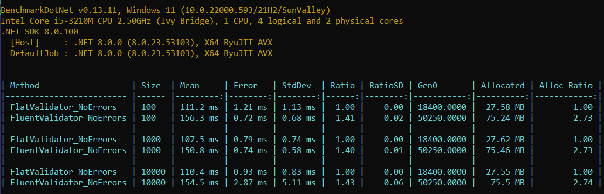
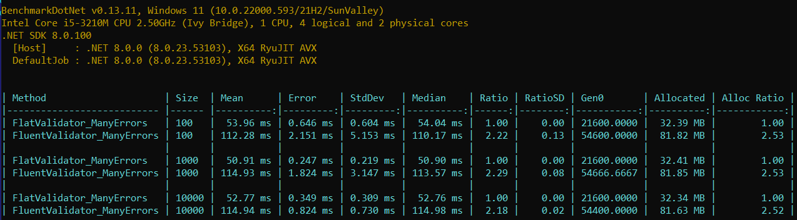

<p align="center"></p>

The `FlatValidator` is a validation library for .NET that delivers an high performance and memory prudence by using lambda-based and strongly-typed rules.

## Quick examples

In general, there are two simple ways to validate custom data with the `FlatValidator`.

### 1. Inline mode

> You can define validation rules in your code to validate object locally.

```js
var model = new SomeModel(Email: "email", BirthDate: DateTime.Now, Rate: -100);

// synchronous version
var result =  FlatValidator.Validate(model, v =>
{
    // IsEmail() is one of funcs for typical data formats like Phone, Url, CreditCard, etc.
    v.ValidIf(m => m.Email.IsEmail(), "Invalid email", m => m.Email);

    v.ErrorIf(m => m.Rate < 0, "Negative Rate", m => m.Rate);

    v.WarningIf(m => m.BirthDate.AddYears(10) >= DateTime.Now, 
                "Age looks like incorrect", m => m.BirthDate);
});

// or asynchronous version
var result = await FlatValidator.ValidateAsync(model, v => 
{
    v.ErrorIf(async m => await userService.IsUserExistAsync(m.Email),
              "User already registered", m => m.Email);

    // the same without `async/await`
    v.ErrorIf(m => userService.IsUserExistAsync(m.Email),
              m => $"Email {m.Email} already registered", m => m.Email);
});

// to check the validation result
if (!result) 
{
    // ToDictionary() => Dictionary<PropertyName, ErrorMessage[]>
    return TypedResults.ValidationProblem(result.ToDictionary()) 
}


```

### 2. Inheritance of the `FlatValidator` class

> Another way is to inherit the `FlatValidator` to define custom rules in the constructor. 
Also you can pass dependencies into constructor to get additional functionality inside of the validation rules.

```js
public record UserModel(string Forename, string Surname, ....);

public class UserValidator: FlatValidator<UserModel> 
{
    public UserValidator(ILogger logger, IPostalService postalService) 
    {
        logger.LogInfo("Validating...");

        ErrorIf(m => m.Forename.IsEmpty() || m.Surname.IsEmpty(),
                "Forename and Surname can not be empty.", 
                m => m.Forename, m => m.Surname);
        
        // use 'If(...)' to control a validation flow
        If(m => m.ShipmentAddress.NotEmpty(), @then: m =>
        {
            ValidIf(async m => await postalService.AddressExistsAsync(m.Address),
                     "Postal address not found.", m => m.Address);

            WarningIf(m => !m.Phone.IsPhone(), "No contact phone.");
        },
        @else: m => // @else section is optional
        {
            ValidIf(m => m.Phone.IsPhone(), "invalid phone number.", m => m.Phone);
        });
    }
}
```
> Now lets validate some object with it
```js
// now let's validate
var validator = new UserValidator();
var result = validator.Validate(new UserModel(...)); // synchronous call of your UserValidator
var result = await validator.ValidateAsync(customer, cancellationToken); // the same asynchronously
if (!result)
{
    var errors = result.Errors; // result.Errors is a List<PropertyName, error, Tag>
    var dict = result.ToDictionary(); // dict is a Dictionary<PropertyName, ErrorMessage[]>
}

// Inspect any validation failures.
bool success = results.IsValid;
List<ValidationFailure> failures = results.Errors;
```


## Benchmarks






## Installation
[](https://www.nuget.org/packages/FlatValidator/)

Install the [FlatValidator](https://www.nuget.org/packages/FlatValidator) from NuGet:
``` console
❯ dotnet add package FlatValidator
```

If installing into an ASP.NET Core project, consider using the [FlatValidator.DependencyInjection](https://www.nuget.org/packages/FlatValidator.DependencyInjection) package that adds extensions specific to ASP.NET Core
``` console
❯ dotnet add package FlatValidator.DependencyInjection
```


## Release Notes and Change Log

Release notes [can be found on GitHub](https://github.com/belset/FlatValidator/blob/main/CHANGELOG.md).


## Supporting the project

If you like my activities, it may be great to give me a ⭐ and/or share this link with friends 🤗

The `FlatValidator` is developed and supported by [@belset](https://github.com/belset) for free in spare time, so that financial help keeps the projects to be going successfully.

[](https://www.buymeacoffee.com/belset)

---
